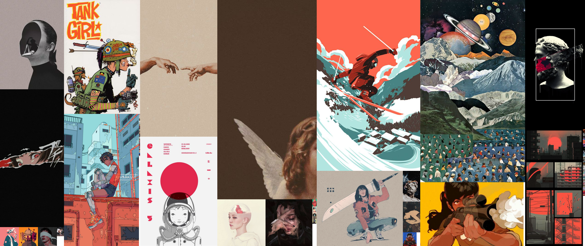

<div style="text-align:center"></div>

# Description

A simple CLI tool to aggregate low resolution images into a decent wallpaper.
In another word, an image collage.

# Usage

```console
./packer [OPTIONS]

    -p, --path      Full path to folder containing images
    -w, --width     Width of the result image/wallpaper
    -h, --height    Height of the wallpaper  
    -o, --output    Full path to output image
```

### Example

```console
./packer -p "/home/atran/Desktop/inspiration" \
> -w 1920 \
> -h 1080 \
> -o ./wallpaper.png
```

# Notes
I don't own any of the art in this repo. Feel free to make
an PR to fix that